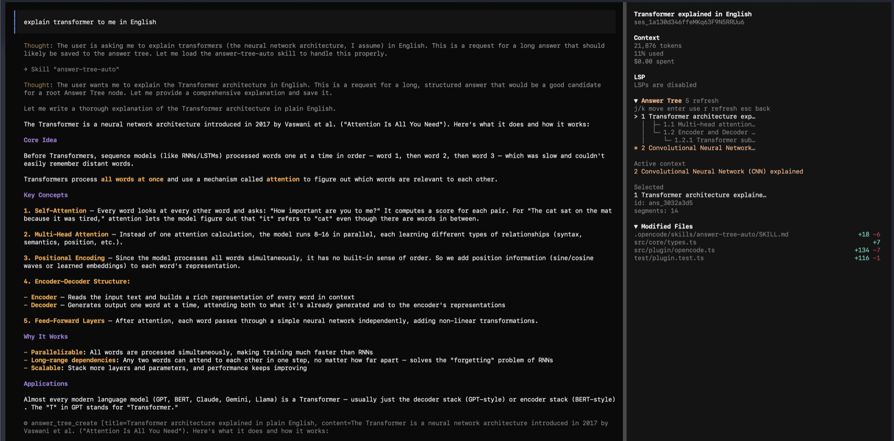

# OpenCode Answer Tree

[中文](README.zh.md) | [English](README.md)

OpenCode Answer Tree 是一个 1.0 版本的 OpenCode 工作区，右侧带回答树。它把长回答保存成可追问的树节点，让你在多层追问和多个话题之间切换时，不需要反复翻聊天历史。



## 解决什么问题

LLM 一次回答很长时，后续经常会出现这些问题：

- 想追问某一段，但要先往上翻很久。
- 问了几层之后，已经分不清当前问题基于哪段回答。
- 同一个 session 里聊多个话题时，历史会混在一起。
- 需要复盘、导出、分享时，聊天时间线不如树结构清楚。

Answer Tree 的目标是把普通聊天变成这种结构：

```text
1 Transformer 架构详解
  1.1 Self-Attention QKV
  1.2 多头注意力机制
    1.2.1 每个注意力头如何产生

2 CNN 架构详解
  2.1 卷积核是什么
```

每个 OpenCode session 可以有多棵根树，但同一时间只有一个 active context。你可以用右侧 sidebar 在不同话题之间切换焦点，左侧聊天历史会跟着跳到对应回答。

## 当前能力

- 自动保存长回答或结构化回答为根节点。
- 明确追问当前节点时，自动保存为子节点。
- 自动判断追问更适合挂到哪个父节点，默认优先使用 active context。
- 跳过非常细节的问题，并把树深度限制在三层。
- 同一个 session 支持多个根话题。
- 右侧 Answer Tree sidebar 显示树、编号、selected 节点和 active context。
- `j/k` 切换节点时，左侧聊天历史同步滚动到对应回答。
- 支持用 `space` 展开 / 折叠单个节点，也支持全部展开和全部折叠。
- `enter` 把 selected 节点设为新的 active context。
- 节点编号显示为 `1`、`1.1`、`1.1.1`。
- 支持重命名、删除、查看完整节点、模糊切换节点。
- 支持 CLI、独立 TUI viewer、Markdown 导出。
- 一条命令 `npm run validate` 验证主项目和内置 OpenCode host。

## 快速开始

环境要求：

```text
Node.js >= 20
npm
Bun
```

从 GitHub clone 后：

```bash
git clone https://github.com/linqichenggg/opencode-answer-tree.git
cd opencode-answer-tree
npm run setup
npm run opencode
```

`npm run setup` 会做三件事：

```text
安装 Answer Tree 依赖
安装内置 OpenCode host 依赖
构建 Answer Tree
```

启动后请用这个入口：

```bash
npm run opencode
```

直接运行全局 `opencode` 会进入原版 OpenCode。Answer Tree 右侧面板只在 `npm run opencode` 启动的版本里出现。

## 第一次试用流程

进入 `npm run opencode` 后，按下面流程试：

1. 问一个会产生长回答的问题：

```text
请详细解释 Transformer 架构
```

2. 回答结束后，右侧应该出现第一棵树：

```text
1 Transformer 架构详解
```

3. 继续围绕当前回答追问：

```text
继续解释 self-attention 这一部分
```

4. 如果回答足够长或结构化，右侧会出现子节点：

```text
1 Transformer 架构详解
  1.1 Self-Attention 解释
```

5. 换一个新话题：

```text
what is CNN
```

6. 新话题会成为新的根节点：

```text
1 Transformer 架构详解
2 CNN 解释
```

## Sidebar 操作

```text
ctrl+x z  进入 Answer Tree 模式
j/k       选择上一个 / 下一个节点
space     展开 / 折叠 selected 节点
enter     把 selected 节点设为 active context
a         展开所有节点
z         折叠所有有子节点的分支
r         刷新
esc/q     回到聊天
```

界面里的两个状态：

```text
Selected        当前光标选中的节点
Active context  后续追问会基于的节点
```

当你用 `j/k` 移动 selected 节点时，左侧聊天历史会尝试跳到对应回答。按 `enter` 后，selected 节点会变成新的 active context。

## 自动生成规则

新话题会生成根节点，例如：

```text
what is CNN
解释 CNN 是什么
介绍一下 RAG
对比 CNN 和 Transformer
新话题：解释 diffusion model
```

明确追问当前节点会生成子节点，例如：

```text
继续解释这个
展开第 2 点
这里为什么这样设计
上面那段是什么意思
```

非常细节的问题会保留在聊天里，但不会继续生成树节点，例如：

```text
QKV 是什么
这个符号是什么意思
为什么这里是 0.2
```

子节点最多显示三层：`1`、`1.1`、`1.1.1`。更深的细节链会作为普通聊天继续，不会生成 `1.1.1.1`。

当前底层保存阈值：

```text
根节点：超过 600 字符，或 3 个以上 bullet，或 3 段以上
子节点：超过 300 字符，或 2 个以上 bullet，或 2 段以上
```

太短的回答会跳过，sidebar 会显示最近一次结果：

```text
Last answer: saved #ans_xxxxxxxx
Last answer: skipped
```

## 数据保存位置

Answer Tree 数据保存在项目目录：

```text
.answer-tree/opencode-state.json
```

CLI 默认数据保存在：

```text
.answer-tree/state.json
```

这些文件是本地状态文件，不需要提交到 GitHub。

## CLI 用法

创建根回答：

```bash
node dist/src/cli/index.js create --file examples/long-answer.md --title "长回答 A"
```

查看回答树：

```bash
node dist/src/cli/index.js list
```

查看 OpenCode 插件保存的回答树：

```bash
node dist/src/cli/index.js list --store opencode
```

查看分段：

```bash
node dist/src/cli/index.js show <nodeId>
```

围绕当前节点连续追问：

```bash
node dist/src/cli/index.js current --store opencode
node dist/src/cli/index.js use <nodeId> --store opencode
node dist/src/cli/index.js ask-current "继续解释这一段" --segment 1 --store opencode
node dist/src/cli/index.js attach-last "这是上一问的回答" --title "子回答" --store opencode
```

导出：

```bash
node dist/src/cli/index.js export --store opencode --out answer-tree.md
```

## OpenCode Slash Commands

```text
/tree-list
/tree-current
/tree-use ans_xxxxxxxx
/tree-use-match self attention
/tree-show ans_xxxxxxxx
/tree-show-full ans_xxxxxxxx
/tree-rename ans_xxxxxxxx 新标题
/tree-delete ans_xxxxxxxx
/tree-ask ans_xxxxxxxx segment=2 这里为什么要这样设计？
/tree-ask-current segment=2 这里为什么要这样设计？
/tree-attach q_xxxxxxxx title=新的子回答 这里是模型回答正文
/tree-attach-last title=新的子回答 这里是模型回答正文
/tree-export
```

这些命令位于 `.opencode/commands/`，底层会调用对应的 `answer_tree_*` tool。

## TUI Viewer

查看 OpenCode 插件保存的回答树：

```bash
npm run build
node dist/src/tui/index.js --store opencode
```

如果中文显示成问号，使用 ASCII 兼容模式：

```bash
node dist/src/tui/index.js --store opencode --ascii
```

快捷键：

```text
↑/↓ 或 j/k   选择节点
e            导出 Markdown
r            重新读取状态文件
q            退出
```

## 开发验证

```bash
npm run validate
```

这条命令会依次运行：

```text
主项目测试
CLI/TUI smoke 测试
内置 OpenCode host typecheck
```

也可以单独运行：

```bash
npm test
npm run smoke
```

## 项目结构

```text
src/core        Answer Tree 数据模型、分段、挂接、导出
src/plugin      OpenCode tools 和自动捕获逻辑
src/cli         命令行工具
src/tui         独立 TUI viewer
.opencode       OpenCode commands / skill / plugin loader
opencode-host   内置 OpenCode 宿主源码，包含右侧 sidebar
docs            设计、验证和后续计划
```

## 当前边界

- 这是内置 OpenCode host 的一仓库版本。
- 普通全局 `opencode` 命令仍然是原版 OpenCode。
- Answer Tree 版需要通过 `npm run opencode` 启动。
- 还没有发布成普通用户一键安装的 OpenCode 发行版。
- 旧节点如果没有 `opencodeMessageId`，左侧跳转会使用内容和时间兜底匹配。

更多说明见：

- `docs/PRODUCT_PLAN.md`
- `docs/ARCHITECTURE.md`
- `docs/COMMANDS.md`
- `docs/TUI.md`
- `docs/SELF_REVIEW.md`
- `docs/VALIDATION.md`
- `docs/NEXT_STEPS.md`
